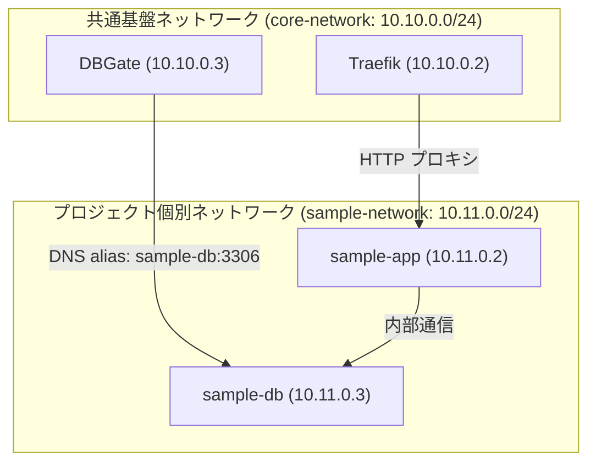

# devctl Sample Project

devctl のマルチプロジェクト管理およびマルチネットワーク構成（個別サブネット + 共通基盤ネットワーク）を実証するためのサンプル環境です。

## 構成概要

- **アプリケーション (`app`)**: PHP 8.2 + Apache
- **データベース (`db`)**: MySQL 8.0
- **共通基盤連携**:
  - Traefik によるリバースプロキシ (`http://sample.localhost`)
  - DBGate からのデータベース管理アクセス (`sample-db:3306`)

## ネットワーク設計

本環境は2つの Docker ネットワークに所属しています。



1. **`sample-network` (10.11.0.0/24)**:
   プロジェクト内部のコンテナ間通信（`app` ⇄ `db`）用ネットワーク。固定 IP アドレスが割り振られます。
2. **`core-network` (10.10.0.0/24)**:
   共通基盤（Traefik, DBGate）と接続するための外部ネットワーク（`external: true`）。
   `db` コンテナには `aliases: - sample-db` が設定されており、DBGate からホスト名 `sample-db` で名前解決・接続できます。

## 起動方法

### 1. 環境変数の準備

```bash
cp _docker/.env.example _docker/.env
```

### 2. devctl からの起動

`~/.config/devctl/config.yaml` に以下のように登録します：

```yaml
projects:
    sample:
        description: "サンプルアプリケーション環境 (PHP + MySQL)"
        workdir: "~/workspace/devctl/examples/sample"
        compose_files:
            - "compose.yml"
        env_file: "_docker/.env"
        depends_on:
            network: true
            core:
                - "traefik"
                - "dbgate"
```

起動コマンド：

```bash
# 共通ネットワークおよび依存する Core を自動起動して立ち上げ
devctl up sample
```

起動後、以下の URL にアクセスできます：
- **Web アプリケーション**: http://sample.localhost
- **DBGate 管理画面**: http://dbgate.localhost
- **Traefik ダッシュボード**: http://traefik.localhost
